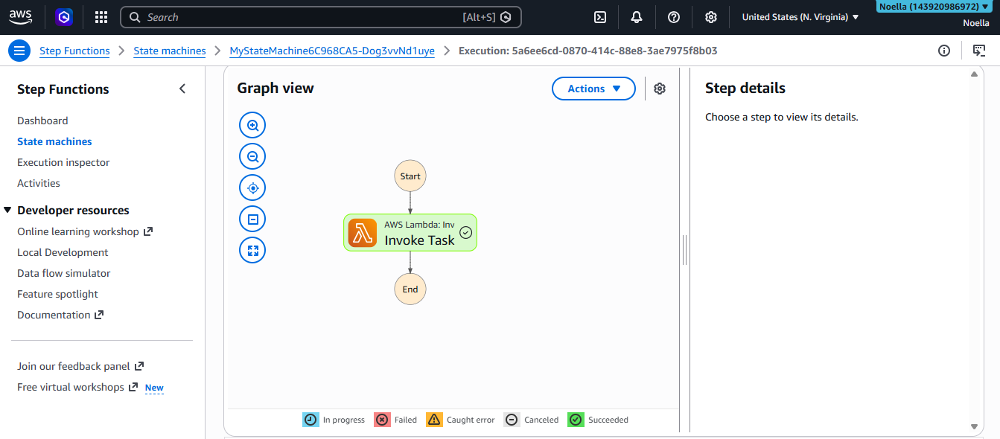
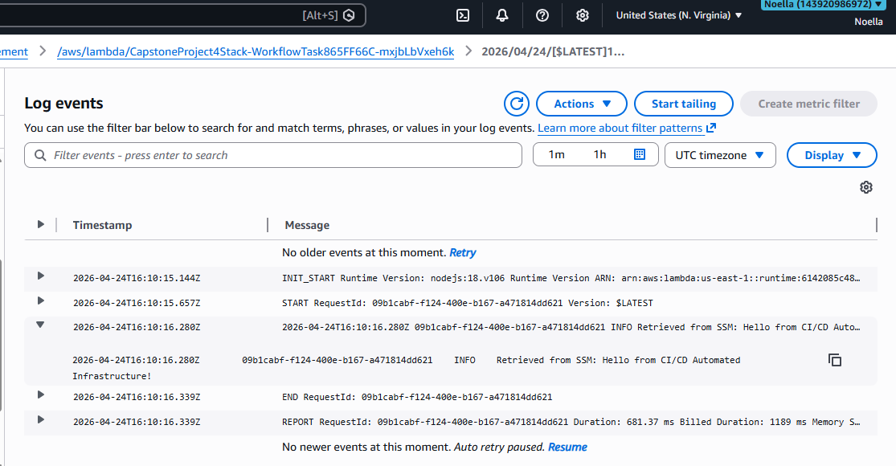
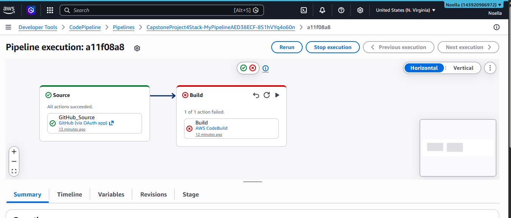

# Capstone Project 4: Multi-Account Serverless CI/CD Pipeline

## Architecture Overview

This project uses AWS CDK to define an automated CI/CD pipeline that deploys a Serverless Workflow using AWS Step Functions and AWS Lambda, integrating with AWS Systems Manager (SSM) for dynamic configuration management.

### Components
- **Infrastructure as Code:** AWS CDK (TypeScript)
- **CI/CD Automation:** AWS CodePipeline + CodeBuild
- **Workflow Orchestration:** AWS Step Functions
- **Compute:** AWS Lambda (Node.js 18)
- **Configuration:** AWS SSM Parameter Store

## Step 1: SSM + Lambda
- SSM Parameter `/app/config/greeting` stores a greeting string
- Lambda function retrieves the parameter at runtime using AWS SDK v3
- IAM permissions granted via CDK `grantRead()`

## Step 2: Step Functions
- State Machine with a Task state invoking the Lambda function
- Error handling configured with 2 retry attempts

## Step 3: CI/CD Pipeline
- CodePipeline connected to GitHub repository
- Triggers automatically on push to `main` branch
- CodeBuild runs `npm install` and `npm run build`

## Screenshots

### Successful Step Functions Execution


### CloudWatch Logs - SSM Parameter Retrieved


### CodePipeline Execution


## Deployment Instructions

```bash
# Install dependencies
npm install

# Build
npm run build

# Bootstrap AWS environment
cdk bootstrap

# Deploy
cdk deploy
```
